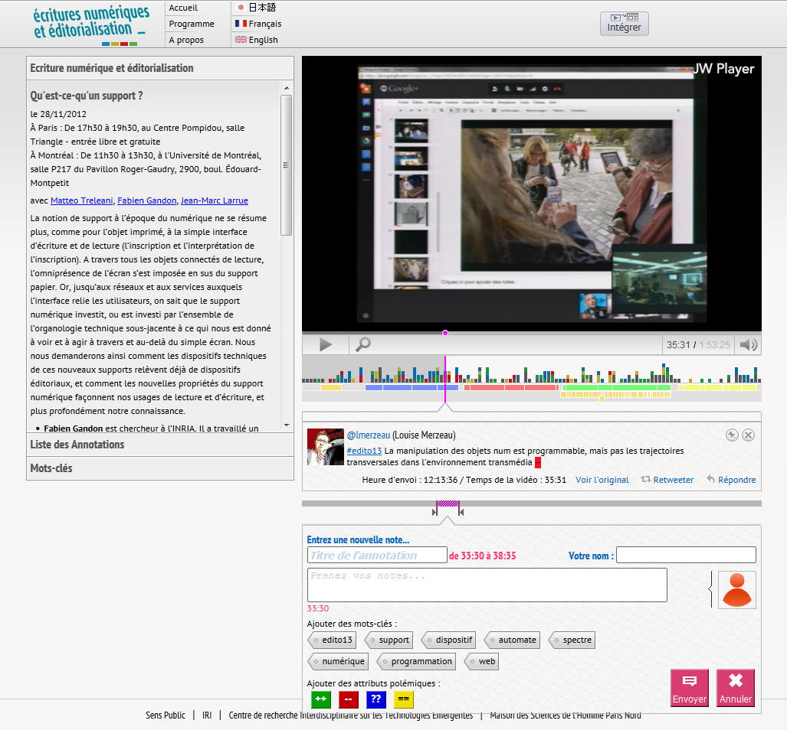
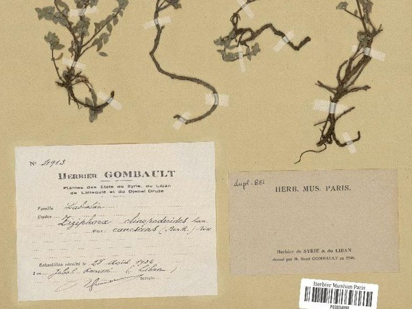
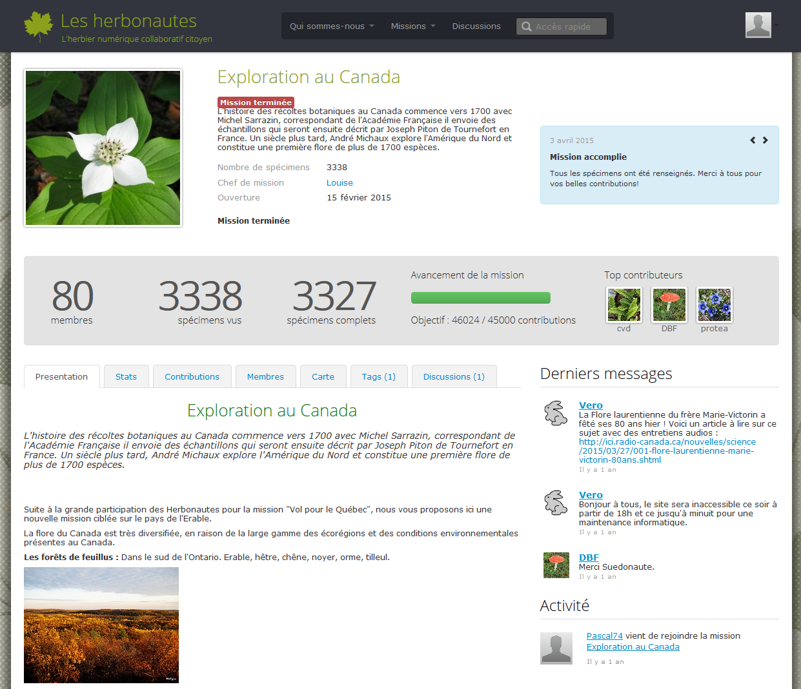
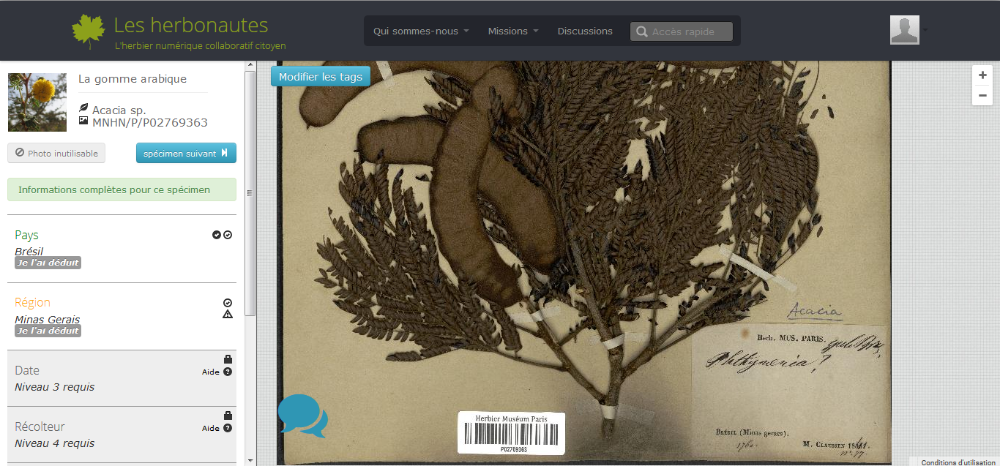
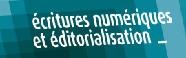

# Illustration

through case studies of editorialisation

%%%

## Editorialisation of event
&nbsp;

### [Polemictweet.com](http://polemictweet.com)

<small>credits : Samuel Huron</small>

¤¤¤

<h3 id="during-the-event">During the event</h3>

Combination of :
<ul>
<li>**live stream**</li>
<li>**twitter client** with simple syntax for tweet categorisation</li>
<li>**infos**: abstract, speakers bio</li>
<li>**live visualisation**: zoomable with tweet agregation </li>
<li>**keywords**: automatic extraction and categorisation</li>
</ul>

¤¤¤

<h3 id="after-the-event">After the event</h3>

An dynamic archive of :
<ul>
<li>**video player**</li>
<li>**timeline of chapter**</li>
<li>**timeline of tweets**:  synchronized and categorized, the tweets are searchable</li>
<li>**intra-video annotation widget**: feed the timeline with more searchable index</li>
<li>(slides)</li>
</ul>

¤¤¤

### Editorialisation caracteristics

* **open** : multiplicity of actors, community driven
* **dynamic** : read&write interface
* **processual** : continuous enrichment through annotation
* **performative** : interactions with the physical event

&nbsp;

Further reading:  
information: [http://www.iri.centrepompidou.fr/outils/polemic-tweet/](http://www.iri.centrepompidou.fr/outils/polemic-tweet/)  
publication: [http://www.aviz.fr/wiki/pmwiki.php/Research/PolemicTweet](http://www.aviz.fr/wiki/pmwiki.php/Research/PolemicTweet)

%%%

## Editorialisation of archive

&nbsp;

### Les Herbonautes
[http://lesherbonautes.mnhn.fr/](http://lesherbonautes.mnhn.fr/)  
citizen collaborative digital herbarium

¤¤¤

<h4 id="from-dusty-archive-to-citizen-science">From (dusty) archive to citizen science</h4>

  <ul>
    <li><strong>massive digitalization</strong> of herbarium archives</li>
    <li><strong>mediation-oriented database</strong>: dedicated to participation and appropriation</li>
    <li><strong>website</strong> open for contributions:
      <ul>
        <li>tagging, annotating, questionning, collecting, sharing</li>
        <li>creating new interpretative contexts: <em>&quot;collaboratory&quot;</em></li>
      </ul>
    </li>
    <li><strong>mediation</strong>:
      <ul>
        <li>calls for participation: <em>&quot;mission&quot;</em></li>
        <li>validation, discussion and peer-reviewing</li>
        <li>badges</li>
        <li>thematic visits</li>
      </ul>
    </li>
  </ul>

  

¤¤¤

  

¤¤¤

  

¤¤¤
### What is at stake ?

> Editorialisation sets the prerequisite for the re-appropriation of datas, archive, knowledge, ...

<i class="fa fa-arrow-right"></i> knowledge production & circulation

&nbsp;

Further reading:  
 [http://bbf.enssib.fr/consulter/bbf-2013-05-0027-006](http://bbf.enssib.fr/consulter/bbf-2013-05-0027-006)

%%%
### More case studies

_Editorialisation of..._ | _exemples_
:--|:--
**archive** | [CDLI](http://cdli.ox.ac.uk/wiki/) & [Assyronline](http://passes-present.eu/en/themes-research/active-knowledge-past/digital-humanities-and-assyriology-tools-online-history#.VK_iGcZjCQs)
**scientific community** | http://hypotheses.org/
**research process** | http://modesofexistence.org/
**lab** | http://networkcultures.org/
**conference** | http://enmi-conf.org/wp/enmi12/
**manuscripts** | https://anno.tate.org.uk/, [The Devonshire Manuscript](https://crrs.ca/publications/ov19/)
**journey** | [#transcan16](http://ecrituresnumeriques.ca/fr/2016/5/26/En-route-vers-Calgary)
<!-- .element: style="font-size:0.7em" -->

<!-- .element: style="font-size:0.7em" --> **Meta-tools** : [MediaWiki](https://www.mediawiki.org/wiki/MediaWiki), [Scalar](http://scalar.usc.edu/scalar/), [Scenari](https://scenari.org/), ...

%%%

### Thank you !

&nbsp; | &nbsp;
--:|:--
<small>**Marcello Vitali Rosati**</small> | <small>_marcello.vitali.rosati@umontreal.ca @monterosato_</small>
<small>**Nicolas Sauret**</small> | <small>_nicolas.sauret@umonreal.ca @nicolasauret_</small>
&nbsp; | &nbsp;

<small>
[ecrituresnumeriques.ca](http://ecrituresnumeriques.ca)  
Canada Research Chair _Digital textualities_  
  
</small>
&nbsp;
<small>[seminaire.sens-public.org](http://seminaire.sens-public.org)  
Workshop editorialization   
  
</small>  
&nbsp;

<small>Congress 2016  May 28 - June 3 Calgary, AB</small>
