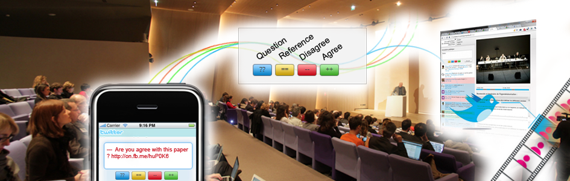

# Illustration

through exemples of editorialisation

%%%

## Editorialisation of an event
&nbsp;

### [Polemictweet.com](http://polemictweet.com)

<small>credits : Samuel Huron</small>

¤¤¤

<h3 id="during-the-event">During the event</h3>

Combination of :
<ul>
<li>**live stream**</li>
<li>**twitter client** with simple syntax for tweet categorisation</li>
<li>**infos**: abstract, speakers bio</li>
<li>**live visualisation**: zoomable with tweet agregation </li>
<li>**keywords**: automatic extraction and categorisation</li>
</ul>

¤¤¤

<h3 id="after-the-event">After the event</h3>

An dynamic archive of :
<ul>
<li>**video player**</li>
<li>**timeline of chapter**</li>
<li>**timeline of tweets** :  synchronized and categorized, the tweets are searchable</li>
<li>**intra-video annotation widget** : feed the timeline with more searchable index</li>
<li>(slides)</li>
</ul>

¤¤¤

### Editorialisation caracteristics

* **open** : multiplicity of actors, community driven
* **dynamic** : read&write interface
* **processual** : continuous enrichment through annotation
* **performative** : interactions with the physical event

&nbsp;

Further reading:  
information: [http://www.iri.centrepompidou.fr/outils/polemic-tweet/](http://www.iri.centrepompidou.fr/outils/polemic-tweet/)  
publication: [http://www.aviz.fr/wiki/pmwiki.php/Research/PolemicTweet](http://www.aviz.fr/wiki/pmwiki.php/Research/PolemicTweet)

%%%

## Editorialisation of an archive

&nbsp;

### Les Herbonautes
citizen collaborative digital herbarium
[http://lesherbonautes.mnhn.fr/](http://lesherbonautes.mnhn.fr/)

¤¤¤
### Citizen and participative science
step-by-step:
* massive digitalization of herbarium archives
* mediation-oriented database : dedicated to participation and appropriation
* website open for contributions :
  * tagging, annotating, questionning, collecting, sharing
  * creating new interpretative contexts
* mediation :
  * calls for participation ("mission"),
  * thematic visits,
  * peer-reviewing and discussion

¤¤¤
### What is at stake ?
&nbsp;

> Editorialisation creates the sine-qua-non conditions for the re-appropriation of datas/archive/knowledge

<i class="fa fa-arrow-right"></i> Citizen Science

%%%

## Editorialisation of a community
%%%
## Editorialisation of a database
%%%
## Editorialisation of a research process

##
